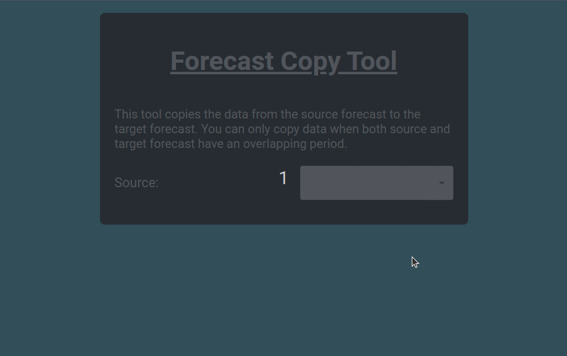

# Forecast Copy Tool

This is a simple tool that simulates copying data from a source forecast to a target forecast.

In the beginning the available forecasts need to be fetched from the "server" (located in `public/forecastruns.json`). To fetch them you can simply make a REST call to `GET forecastruns.json`.

The tool should then show a dropdown to select the source Forecast. As soon as a source is selected a second dropdown should appear that contains all candidate target forecasts. A forecast is a candidate forecast `t` when for the selected source forecast `s` there is an overlapping time period between `s` and `t`.

If there are no candidates found for the source forecast, a warning should be displayed noting that no overlapping forecast were found.

After selecting a valid target forecast a `COPY` button sould appear. When clicking this copy button a confirm box should raise, describing the source and target forecasts. When the user confirms, the process is finished and an finish message is displayed.

## Your task
Your task is to implement the missing behavior as described before. We have already implemented the `Dropdown` component. You should further implement the logic for the `App` and the `CopyForm` component.

The `App` is the main container. It is responsible for fetching all the forecast runs from the "server". As soon as the forecast runs are received, it mounts a new `CopyForm`. When the copy proccess is finished, the `App` component is responsible for displaying some finish message.

The `CopyForm` component expects the list of forecast runs and an event handler to call when the copy process is finished. It displayes the source and target dropdowns, the copy button, as well as the warning message if no candidates were found. When the copy button is pressed and the confirm box is confirmed the copy process is finished.


### Stylings
Besides the functionality you also need to style the Forecast Copy Tool. We added the `sass` compiler to the project and already prepared `*.module.scss` files for the components. You can assign css classes to your react html elements like this:

```
// Foo.module.scss file

.someClassWithStyles {
    background: red;
}

```

```
// Foo.tsx

import s from './Foo.module.scss';

function Foo() {
    return (
        <div className={s.someClassWithStyles}>Foo Component</div>
    );
}
```


### Note
There is no copy logic at all. This example should only show that you can fetch data from the server, handle the controlls, do some filtering and style components.

## Run
To run the dev environment just run the following command:
```
# using yarn
$ yarn start

# using npm
$ npm run start
```

## Expected Result
